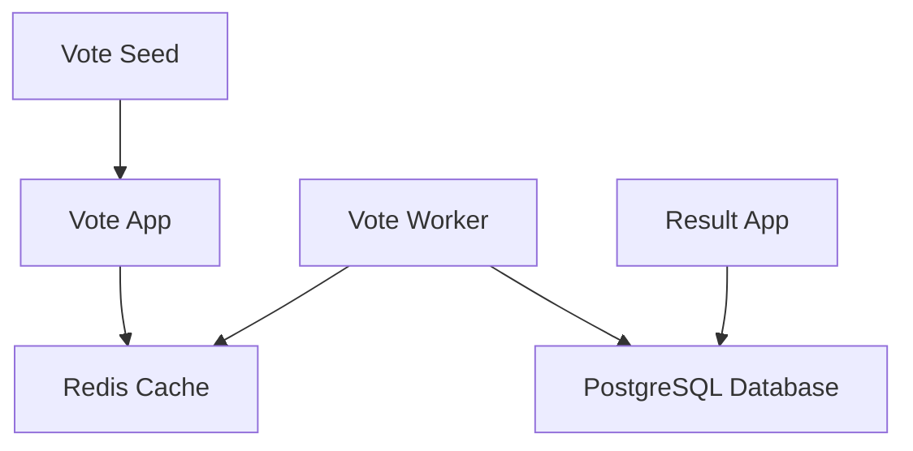

# Example Voting App - Backstage Catalog

This directory contains Backstage catalog definitions for the Example Voting Application, a distributed microservices demonstration.

## Architecture Overview

The application consists of:

- **Vote App** (`vote/`) - Python Flask frontend for casting votes
- **Results App** (`result/`) - Node.js Express frontend for viewing results  
- **Worker** (`worker/`) - .NET Core background service processing votes
- **Redis** - In-memory cache for vote queue
- **PostgreSQL** - Database for storing results

## Catalog Structure

### System Level
- `voting-app` - The overall system encompassing all components
- `demo-applications` - Domain for demo applications

### Components
- `vote-app` - Frontend voting interface (Python Flask)
- `result-app` - Results dashboard (Node.js Express)  
- `vote-worker` - Vote processing service (.NET Core)
- `vote-seed` - Seed data generator (Python)

### Resources
- `redis-cache` - Redis cache resource
- `postgres-database` - PostgreSQL database resource

### APIs
- `voting-api` - REST API for casting votes
- `results-api` - WebSocket/HTTP API for viewing results

## Dependencies

## Getting Started

1. Ensure all services are running via Docker Compose
2. Import the catalog files into your Backstage instance
3. Navigate to the Software Catalog to explore the components

## Service URLs

- Vote Application: http://localhost:8080
- Results Application: http://localhost:8081